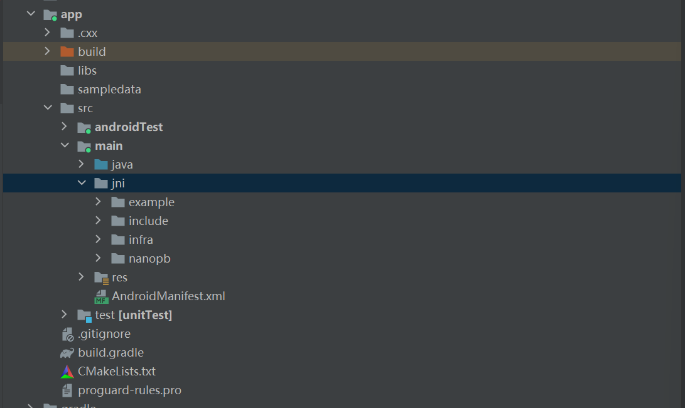
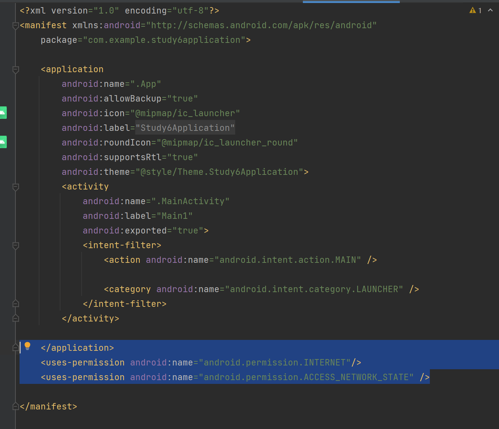
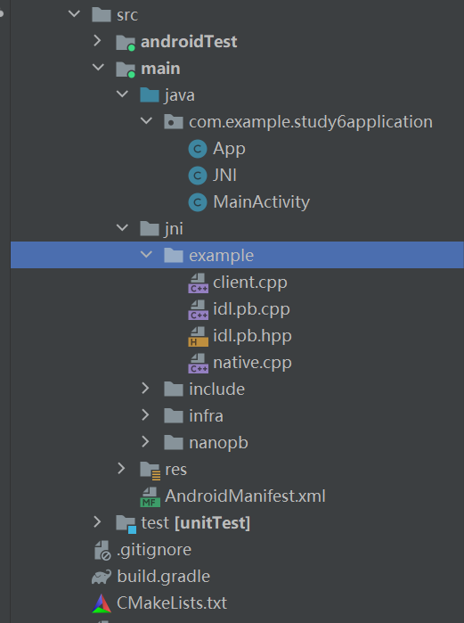
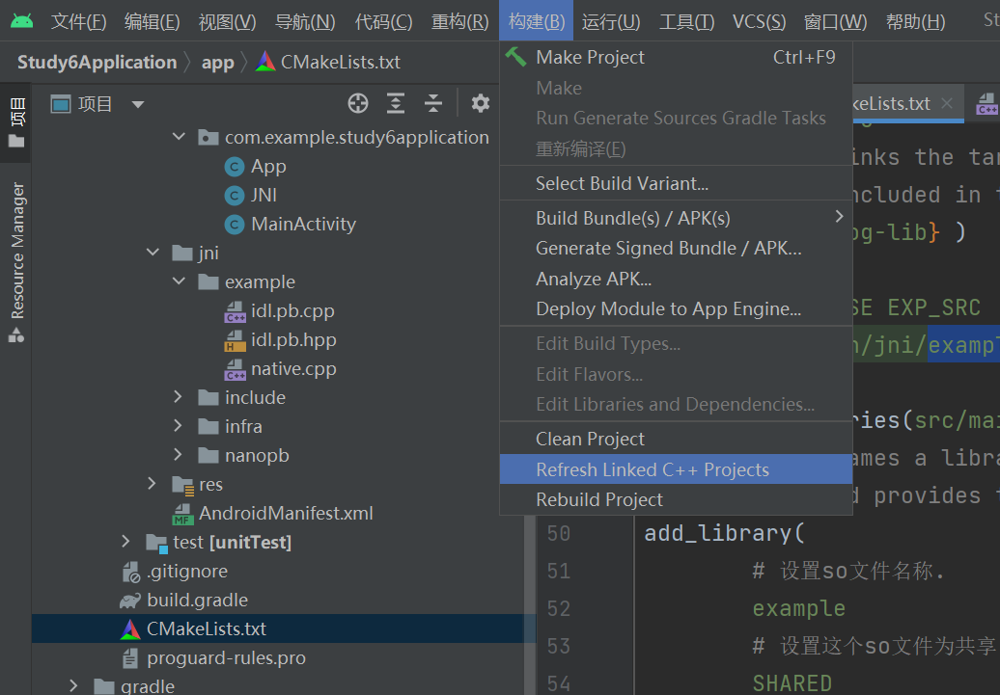

## Android中将其作为原生方法

要在Android中加入原生方法，首先需要配置ndk工具链。具体的配置方法可以参考网站博客。后面的环境相关也都参考的是[这篇文章](https://blog.csdn.net/sevenjoin/article/details/104531190)

### 设置编译工具链

将原生方法的编译工具链添加到**app/build.gradle**中，注意不是根目录的build.gradle:
```groovy
android {
    ...

    defaultConfig {
        ...
        // 需要手动添加
        externalNativeBuild{
            cmake{
                // 指定编译架构
                abiFilters 'arm64-v8a','armeabi-v7a','x86','x86_64'
            }
        }

    }
    // 需要手动添加
    externalNativeBuild{
        cmake{
            version "3.22.1"
            // 在该文件种设置所要编写的c源码位置，以及编译后so文件的名字
            path 'CMakeLists.txt'
        }
    }

    ...
    // 会自动添加
    ndkVersion '25.2.9519653'
}
```
### 为项目编写CMakeLists

新建一个文件夹：app/src/main/jni，将include、infra和nanopb拷贝到app/src/main下的该文件夹中。可以在这个文件夹下再新建一个目录example，之后用来写业务代码。



在**app**目录中新建CMakeLists.txt，指定要编译的源文件、包含文件、依赖库、输出方式等等。
```CMake
cmake_minimum_required(VERSION 3.18.1)
#将所有的源文件保存在RPC_SRC这个变量里
file(GLOB_RECURSE RPC_SRC
        src/main/jni/infra/*.cpp
        src/main/jni/nanopb/*.c
        )
#设置包含路径
include_directories(src/main/jni/include src/main/jni/nanopb)
# 设置MyRPC的编译方法
add_library(
       # 设置库文件名称.
       MyRPC
       # 设置这个so文件为共享.
       SHARED
       # 源文件
       ${RPC_SRC})

# 查找库，这里找一下安卓的log库，MyRPC打印日志要用
find_library( # Sets the name of the path variable.
       log-lib
       # 指定库名称
       log )

target_link_libraries( 
            # 指定目标库.
            MyRPC
            # 指定依赖
            ${log-lib} )

# 设置example的编译方法
# 保存所有源文件
file(GLOB_RECURSE EXP_SRC
        src/main/jni/example/*.cpp
        )
# 设置包含路径
include_directories(src/main/jni/include src/main/jni/nanopb src/main/jni/example)
add_library(
        # 设置so文件名称.
        example
        # 设置这个so文件为共享.
        SHARED
        # 源文件
        ${EXP_SRC})
target_link_libraries( # Specifies the target library.
        # 指定目标库.
        example
        # 指定依赖
        MyRPC )
```

### 为项目申请网络权限

安卓版本更新之后要求必须申请网络权限才能使用socket等协议栈，因此我们需要在AndroidMenifest.xml中加入下列内容：
```xml
    </application>
    <uses-permission android:name="android.permission.INTERNET"/>
    <uses-permission android:name="android.permission.ACCESS_NETWORK_STATE" />
```



###  为项目编写Java接口
这里，我们在src/main/java/com.\<yourGroup>.\<yourAPP>文件夹内新建一个Java类，起名为JNI。



这个类里主要是加载之前编译好的动态库，并且调用对应的原生方法。
```java
public class JNI {
    {
        // 在这里我们需要加载这个so库， 这个名字就是最终编译产出的so的名字，在前面的CMake中定义的
        System.loadLibrary("MyRPC");
        System.loadLibrary("example");
    }
    /* *
     *  定义native方法
     *  调用C代码对应的方法
     *  @return
     */
    public native String new_client(String host, int port);
    public native boolean control_LED(int r, int g, int b);
}
```

### 为项目编写JNI实现

首先我们将已经写好的代码（idl.pb.cpp idp.pb.hpp）复制到example文件夹下，
然后新建一个native.cpp，在里面对我们的代码进行封装，具体细节涉及到原生方法的编写，就不详细讲了，可以参考[这个系列](https://blog.csdn.net/tkwxty/article/details/103609014)：
```c++
#include <stdio.h>
#include <stdlib.h>
#include <jni.h>
#include "idl.pb.hpp"
#define TAG "JNI"

//静态客户端
static myrpc_LEDControl_Client *client = NULL;
extern "C" jstring Java_com_example_study6application_JNI_sayHello(JNIEnv *env, jobject jobj) {
    const char *text = "I am fr c";
    return env->NewStringUTF(text);
}
extern "C" jstring Java_com_example_study6application_JNI_new_1client(JNIEnv *env, jobject jobj, jstring host, jint port){
    char const * c_str = NULL;
    jboolean isCopy;
    c_str = env->GetStringUTFChars(host, &isCopy);
    if(c_str == NULL)//判断是否获取数据成功
    {
        LOGI(TAG,"Failed to get str");
        return NULL;
    }
    LOGI(TAG,"The String from Java : %s\n", c_str);
    if(client){
        delete client;
    }
    client = new myrpc_LEDControl_Client(c_str, (uint16_t)port);
    return env->NewStringUTF(StatusToString(client->open()));
}
extern "C" jboolean Java_com_example_study6application_JNI_control_1LED(JNIEnv *env, jobject jobj,jint r, jint g, jint b){
    myrpc_Input req;
    myrpc_Output rsp;
    req.r = r;
    req.g = g;
    req.b = b;
    LOGI(TAG, "sending request: r=%" PRId32 " g=%" PRId32 " b=%" PRId32 , req.r, req.g, req.b);
    if(client)client->setColor(&req, &rsp);
    return rsp.success;
}
```


### 构建时出错？

如果删除或者新增了文件，CMake可能不会重新自动加载，这时候就需要手动更新项目（一般报错是ninja找不到某某文件）



可以先Clean Project再Refresh Linked C++ Project，最后重新编译，应该就能成功了。

如果出现了奇奇怪怪的头文件报错（undefined），看一看是不是系统函数，如果是系统函数的话，可以修改一下include中的内容。安卓自动包含的头文件相比Linux少了一些，所以可能出现Linux编译通过但Android编译不通过的情况。添加上对应的头文件就可以了。